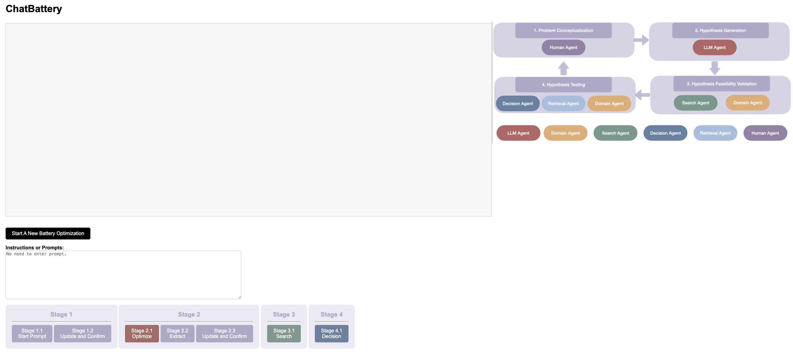

## [ChatBattery] Expert-Guided LLM Reasoning for Battery Discovery: From AI-Driven Hypothesis to Synthesis and Characterization

Authors: Shengchao Liu<sup>\*</sup>, Hannan Xu<sup>\*</sup>, Yan Ai<sup>\*</sup>, Huanxin Li<sup>+</sup>, Yoshua Bengio<sup>+</sup>, Harry Guo<sup>+</sup>


### 1 Environment Setup
```
conda create -n ChatBattery python=3.9
conda activate ChatBattery

pip install pandas
pip install openai==0.28
pip install google-generativeai
pip install Levenshtein
pip install pymatgen==2024.4.13
pip install ase
pip install scikit-learn
pip install xgboost
pip install mp-api==0.41.2
pip install Flask
pip install -e .
```


### 2 Data Preprocess

In our case, we download all the chemical formula including Lithium from ICSDN. Then after preprocessing, the file is `data/Li_battery/preprocessed.csv`.

### 3 Run Scripts
You need to set up API keys:
- **For OpenAI models**: Set the OpenAI API key, type this in terminal `export OPENAI_API_KEY=xxxxx`.
- **For Google Gemini models (recommended)**: Set the Google API key, type this in terminal `export GOOGLE_API_KEY=xxxxx`. Get your API key from [Google AI Studio](https://aistudio.google.com/app/apikey).
- **For Materials Project**: Set the MP API key, you can change it in the file `ChatBattery/search_agent` and reset `MP_api_key = 'xxx'`.

#### 3.1 Exploration Phase

For stage 1 to 4, run this CMD in terminal with your preferred model:
```bash
# Using Gemini 2.5 Flash (default, recommended)
python main.py --LLM_type=gemini_2.5_flash

# Using Gemini 2.5 Pro (more capable but slower)
python main.py --LLM_type=gemini_2.5_pro

# Using Gemini 2.0 Flash (experimental)
python main.py --LLM_type=gemini_2.0_flash

# Using OpenAI models (if you have OpenAI API key)
python main.py --LLM_type=chatgpt_3.5
python main.py --LLM_type=chatgpt_o1
python main.py --LLM_type=chatgpt_o3
```

The default address is `127.0.0.1:5000`. Simply open this address in your browser, and you will see the interface displayed like this:

<p align="center">
   
</p>

Then please follow the instructions from stage 1 to stage 4. Enter `Ctrl + C` if you want to stop the program.
The results are collected into a csv file, which will be fed into the next stage.

##### 3.2 Exploitation Phase

- Stage 5, first please get prepared the input file
```bash
cd stage_05_deduplication
python stage_05_deduplication.py --input_file=xxx
```

- Stage 6, then run the following CMD
```bash
cd stage_06_ranking
bash stage_06_ranking.sh
```

